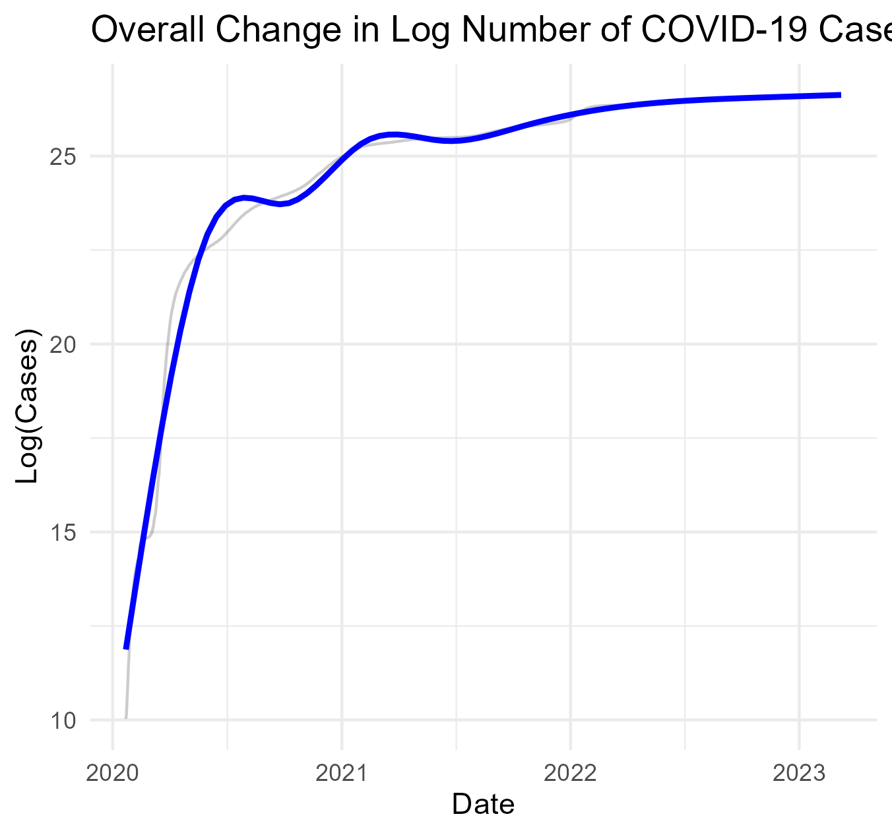
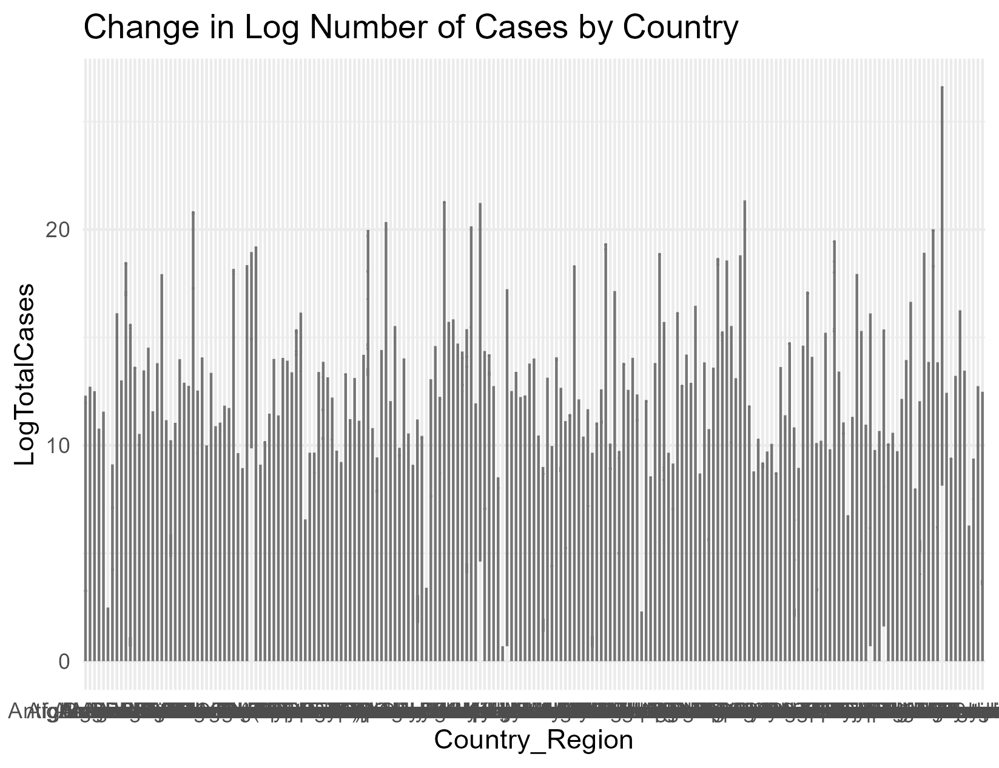
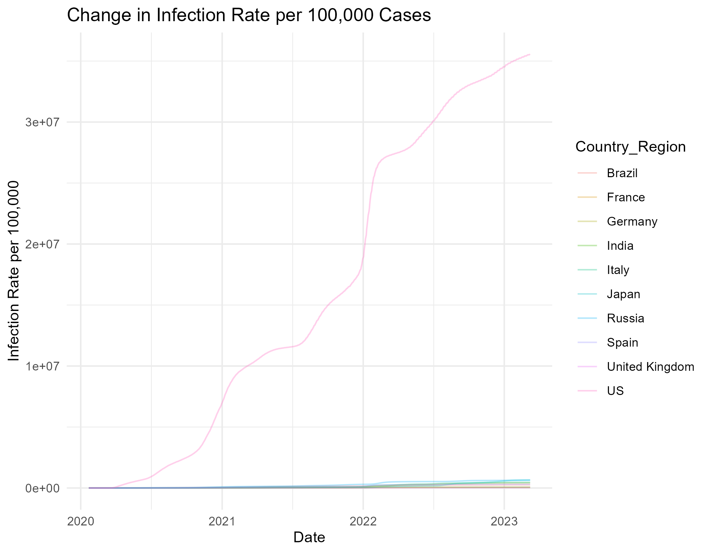

# SURV675-HW1-Task3

## COVID-19 Data Analysis Project

### **Project Description**
This project analyzes COVID-19 case trends using datasets from the [Johns Hopkins University GitHub repository](https://github.com/CSSEGISandData/COVID-19). The objective is to merge two datasets—`UID_ISO_FIPS_LookUp_Table` and `time_series_covid19_confirmed_global`—to explore trends in the number of COVID-19 cases. The final analysis includes visualizations of:
- Overall change in the log-transformed number of cases over time.
- Change in log-transformed number of cases per country.
- Change in infection rate per 100,000 people over time.

### **Repository Structure**
- R scipt is at the main page
- Data are at the data folder
- Outputs are plots at plots folder

### **Main Findings & Visualizations**

#### **1️⃣ Overall Change in Log Number of Cases**

- **Description**: This plot tracks the **log-transformed** total number of COVID-19 cases over time.
- **Key Observation**: The trend exhibits a steep increase in early 2020, followed by a stabilization phase, indicating waves of infections.
- **Interpretation**: The **log transformation** helps handle large variations, making trends more interpretable.

---

#### **2️⃣ Change in Log Number of Cases by Country**

- **Description**: This plot compares **COVID-19 case growth across different countries**.
- **Key Observation**: Countries with high total cases dominate, while smaller countries show fluctuations.
- **Interpretation**: This graph highlights **which countries experienced the highest burden** of COVID-19 cases.

---

#### **3️⃣ Change in Infection Rate per 100,000 People**

- **Description**: This plot normalizes case counts by population, tracking **infection rate per 100,000 people**.
- **Key Observation**: Some countries show **sharp increases**, indicating waves of outbreaks.
- **Interpretation**: The infection rate provides a **fair comparison** between countries with different population sizes.

### Reproduce the Analysis
  1. Download datasets `UID_ISO_FIPS_LookUp_Table` and `time_series_covid19_confirmed_global`
  2. Download R packages `install.packages(c("tidyr", "readr", "ggplot2", "dplyr"))`
  3. Run R script `source("hw1t3.R")`
